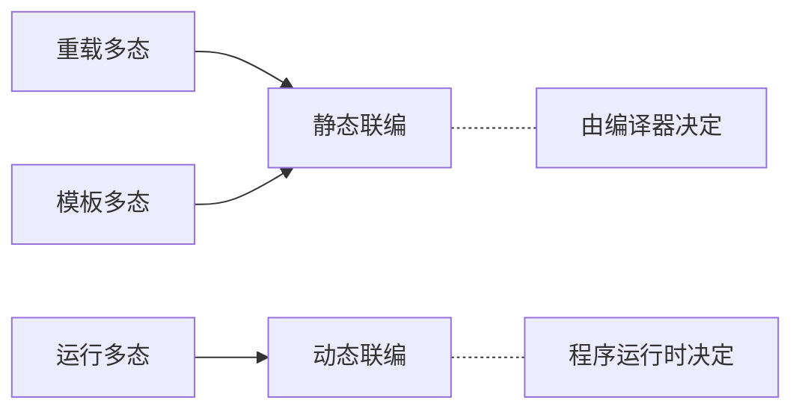

# cpp Basic Note
## 基础
### 基本格式
```cpp
#include <iostream> //打开头文件<iostream>,启动编辑器进行预处理
//istream为输入,ostream为输出,input,output
using namespace std;	//使用标准命名空间
int main()	//表示函数要返回一个整数
{
	<body>；    //代码实现主体
	return 0;	//返回值为0,代表程序运行正确
}
```
- <font color=red>ATTENTION</font>：每句代码后都要有"<mark>`;`</mark>"!!!
- 由表达式和结尾的"`;`"组成一个C++语句;多条C++语句通过`{}`组成一个块语句,结束语句块的大括号外不用加"`;`"
- <mark>`cout`</mark>：标准输出流对象
- <mark>`cin`</mark>：标准输入流对象
- <mark>`endl`</mark>：换行符，代表一句代码的结束
- <mark>`\n`</mark>，<mark>`\t`</mark>
### 头文件
#### 头文件的导入
- 导入外部头文件，头文件名称放在<mark>`<>`</mark>里面
- 导入自定义头文件，头文件名称可以放在<mark>`""`</mark>里面，节约导入时间
#### 头文件的编写
头文件以`.h`为后缀名，内容一般包括常量变量的定义，函数的声明，自定义数据类型的定义等
注：函数的声明一般放在头文件内，函数的定义一般在另外一个引入了该头文件的`.cpp`文件内定义，为方便起见，一般该`.cpp`文件与头文件同名
### 编译预处理
- 常用指令

|       预处理指令       |                    格式                     |                                                     功能                                                     |
| :-------------------: | ------------------------------------------ | ------------------------------------------------------------------------------------------------------------ |
| `#include`            | `#include <头文件>`<br/>`#include "头文件"` | 将一个头文件嵌入(包含)到当前文件                                                                                |
| `#define`             | `#define 标识符字符串`                      | 把字符串命名为标识符，标识符可以表示符号常量或宏名，编写源程序时代替“字符串”出现在程序中，编译时又被替换为“字符串”内容 |
| `#undef`              | `#undef 标识符`                             | 撤销前面用`#define`定义的标识符                                                                                |
|`#if`<br/>`#else`| 与选择结构中的`if - else`语句类似 | 使得程序在不同条件下，完成不同操作 |
| `#ifdef`<br/>`#endif` | `#ifdef 标识符`<br/>`语句`<br/>`#endif`     | 条件编译，如果定义了"标识符"，则编译"语句"                                                                       |
| `#ifndef`             | `#ifndef 标识符`<br/>`语句`<br/>`#endif`    | 条件编译，如果未定义"标识符"，则编译"语句"                                                                       |
|`#pragma`| 见下方 | |
|`#error`| `#error 语句` | 通常与条件编译连用，`#error`后的语句即为当某个条件编译未通过时，报错框输出的语句 |
- `#pragma`：设定编译器的状态或者是指示编译器完成一些特定动作

  - `#pragma message("<message>")`：在控制台显示`<message>`

  - `#pragma once`：在头文件最开始加入，保证头文件只被编译一次

  - `#pragma warning(<command>:<error note>)`：设置警告信息状态
    - `disable:<num>`：屏蔽`<num>`号警告信息

    - `once:<num>`：仅报告一次`<num>`号警告信息

    - `error:<num>`：把`<num>`号警告信息作为一个错误

  - `#pragma comment(comment-type,"commentString")`：
    - `comment-type`是一个预定的标识符，指定注释的类型，一般用来加载静态库
    - `commentString`是一个提供为`comment-type`提供附加信息的字符串

  - `#pragma pack()`：指定对齐长度，用在结构体、联合体中

- 常用预定义符号

  | 符号           | 含义                 |
  | -------------- | -------------------- |
  | `__FILE__`     | 进行预编译的文件名   |
  | `__LINE__`     | `__LINE__`所在的行数 |
  | `__DATE__`     | 文件被编译的日期     |
  | `__TIME__`     | 文件被编译的时间     |
  | `__FUNCTION__` | 所在函数的函数名     |

- <font color=red>ATTENTION</font>:编译预处理不属于C++语句，结尾不用"`;`"

- 一般不用`#define`语句，用常量定义语句来代替常量标识符的定义，用内联函数定义代替宏定义

  - 宏定义只是简单的替换


- 一般在头文件中采用<mark>`#ifdef`</mark>和<mark>`#ifndef`</mark>进行预处理
e.g.
```cpp
#ifndef _DEBUG_PROGRAME_H
//_DEBUG_PROGRAME_H表示一个任意的符号常量标识符
#define _DEBUG_PROGRAME_H
...//其他语句
#endif
```
这样写可以防止头文件的重复嵌入，避免重复定义等错误
- 使用条件编译进行调试

- `#`、`##`与`#@`
	- 均用于编译预处理处
	- ==`#`==：字符串化操作符，用在宏定义中，表示将参数字符串化
	- ==`##`==：符号连接操作符：连接两个参数成为一个标识符
	- ==`#@`==：字符化操作符：只能用于由传入参数的宏定义中，且必须置于宏定义提的参数名前

### 命名空间
namespace
- define: <mark>`namespace <space_name>{}`</mark>
- cite:
	- <mark>`<space_name>::<name>`</mark>
	- <mark>`using <space_name>::<name>`</mark>
	- ==`using namespace <space_name>`==
### 注释
- "`//`"后的单行文字全为注释
- "`/*`与"`*/`"之间的部分全为注释,无论其中有多少行
### 指示符
- "<mark>`<<`</mark>"：输出指示符
- "<mark>`>>`</mark>"：输入指示符
### 标识符
- 函数名、变量名、类名、对象名等
- 规则
    - 不与C++关键字重名
    - 首字符必须为字母或下划线
    - 不包含空格及其他特殊字符
    - 字符长度一般不超过31个字符
    - 内层标识符与外层标识符同名时,内层标识符可见,外层标识符不可见,对变量也是内层变量屏蔽外层变量
     若内层局部变量与全局变量重名且必须使用全局变量时,可用全局作用域运算符(<mark>`::`</mark>)指定要访问的全局变量
### 基本数据类型
- 整型:<mark>`int`</mark>	&emsp;(也可用于输出`char`类型的ASCII码)
- 字符型(单字符):<mark>`char`</mark>&emsp;(只能用来存储<mark>`''`</mark>内的单字符或ASCII码，不能存储汉字)
- 实型(浮点型)
    - 单精度型<mark>`float`</mark>
    - 双精度型<mark>`double`</mark>
- 逻辑型:<mark>`bool`</mark>      (`0`为`False`,非`0`为`True`;输出结果中`1`代表`True`,`0`代表`False`,也可在输出前加上==`boolalpha`==使得输出结果由数字`0`、`1`变为`false`和`true`)
- 字符串型:<mark>`string`</mark>&emsp;(可用于存储字符串,可含汉字,字符串放在`""`内,本质上是字符型数组)
- Tip:可使用关键字==`auto`==来让系统自动判断类型,但此时要直接给变量赋值,不能放在后面再赋值
### 自定义数据类型
- 数组：<mark>`type[]`</mark>	
- 向量：<mark>`vector`</mark>&emsp;(<mark>`#include <vector>`</mark>)
- 指针：<mark>`type*`</mark>	
- 引用：<mark>`type&`</mark>
- 空类型：<mark>`void`</mark>
- 结构：<mark>`struct`</mark>	
- 联合：<mark>`union`</mark>
- 枚举：<mark>`enum`</mark>
- 类：<mark>`class`</mark>
### 修饰基本数据类型
- <mark>`short`</mark>：仅用来修饰int,称为短整型,可简写为`short`
- <mark>`long`</mark>：仅用来修饰int和double,`long int`可简写为`long`
- <mark>`unsigned`</mark>：修饰char、short、int,表示该数据类型为无符号数
- <mark>`signed`</mark> (Default)：修饰char、short、int,表示为有符号数
### 定义类型别名
`typedef <OldTypeName> <NewTypeName>`
### 变量
- 定义变量:`<type> <variable_1>,<variable_2>,...;`
- 变量赋值:
    - 分步
    - 合并
        - `<type> <variable>=<value>`
        - `<type> <variable>(<value>)`
    - 键入赋值:`cin>> <variable>`
#### 变量的存储类型
- auto型：
    - `auto <type> <variable>`
    - <u>***自动变量***</u>，随函数的调用与否而决定是否存在，有利于内存资源的动态使用，故程序中大量使用的都是auto
    - e.g.$\quad$`int a` 全称应为 `auto int a`
- register型：
    - `register <type> <variable>`
    - <u>***寄存型变量***</u>，放在CPU寄存器中存储，而非直接放入内存中，访问速度快，数量有限，若过多则系统会将这些变量设置为auto型局部变量
- extern型：
    - `extern <type> <variable>`
    - <u>***全局变量***</u>，可使用其他文件定义的变量，变量只占用一份空间，但要注意安全性问题
    e.g.
    ```cpp
    //file1.cpp
    int x,y;
    void main()
    {
        ...
    }    
    ```
    ```cpp
    //file2.cpp
    extern int x,y;    //调用file1.cpp定义的变量
    void fun()
    {
        ...
    }
    ```
- static型：
    - `static <type> <variable>`
    - <u>***静态变量***</u>，在运行期间一直占用静态存储器的固定内存
    - 第一次被调用时，被初始化一定的值，且系统之对其初始化一次
        - 指定初始值，则就为初始值
        - 未指定初始值，则初始值为0
    - 静态全局变量只能在定义的文件中使用，不能被其他文件访问
#### 生存期
- 静态生存期变量：<mark>extern型</mark>和<mark>static型</mark>
- 动态生存期变量：<mark>auto型</mark>和<mark>register型</mark>
### 常量
- 符号常量
    - 定义:`const <type> <ConstantName>=<value>`
- 整型常数
	- Default:`int`
	- `<Number>L` or `<Number>l`:长整型
	- `<Number>U` or `<Number>u`:无符号型
	- 进制
	    - 十进制:直接表示
	    - 八进制:开头加0
	    - 十六进制:开头加0X或0x
	    - (其中八进制数和十六进制数只能表示无符号整数)
- 实型常数
	- 小数形式
	- 指数形式:`aEb`或`aeb`代表数值`a*10^b`,其中b必须为十进制整数,a和b都不可省
	- Default:double
	- `<Number>F` or `<Number>f`:单精度型
	- `<Number>L` or `<Number>l`:长双精度型
- 字符常数:`char`
### 运算符
- 常数、符号常量、带运算符的表达式不能放在"`=`"左边作为左值
- "<mark>`++`</mark>":自增(原数+1);"<mark>`--`</mark>":自减(原数-1)
(前缀后缀都可,区别在于该运算发生于表达式之前或之后)
- "<mark>`%`</mark>":取模(只能对整型数进行操作)
- <mark>`+=`,`-=`,`*=`,`/=`,`%=`</mark>
- 整型数相除结果仍为整型数,而只要有其中一个操作数为浮点数,除法结果就是浮点数
- 运算符优先级:<mark>正负、自增减 > 乘除、取模 > 加减 > 含等号运算符</mark>
- `a>b==c`意思为先将a与b比较大小并根据结果记为0或1,再判断其与c是否相等
- `string`对象的比较的实质:比较两个`string`对象的字符的ASCII码值
- <font color=red>ATTENTION</font>:不能连续大于或小于,即类似a<b<c是不合法的!!!
- 逻辑运算符(Logical Operators):
    - 与"<mark>`&&`</mark>"or"<mark>`and`</mark>"
    - 或"<mark>`||`</mark>"or"<mark>`or`</mark>"
    - 非"<mark>`!`</mark>":进行布尔运算
    - 优先级:<mark>`! > && > ||`</mark>
    - 表达式结果为`bool`
- 位运算符(Bitewise Operators):(二进制)
    - 按位与"`&`":将两个操作数对应的每一位分别进行逻辑与操作	(`1&1=1,1&0=1,0&1=1,0&0=0`)
    - 按位或"`|`":将两个操作数对应的每一位分别进行逻辑或操作	(`1|1=1,1|0=1,0|1=1,0|0=0`)
    - 按位异或"`^`":将两个操作数对应的每一位分别进行异或操作	(`1^1=0,1^0=1,0^1=1,0^0=0`)
    - 按位取反"`~`":将操作数的每一位分别进行取反操作
    - 左移位"`<<`":按照指定的位数将操作数向左移动,左移后,低位补0,移出的高位舍弃
    - 右移位"`>>`":按照指定的位数将操作数向右移动,右移后,移出的低位舍弃,无符号数高位补0,有符号数高位补符号位或0
    - 优先级:"<mark>`~`">"`<<`","`>>`">"`&`">"`^`">"`|`">"`&=`","`|=`","`^=`","`<<=`","`>>=`"</mark>
- 条件运算符:<mark>`<expression_1> ? <expression_2> : <expression_3>`</mark>
	意思:`if <expression_1>=True,return <expression_2>,else return <expression_3>`
- 逗号运算符:按顺序处理
### 数据类型转换
- 隐式
- 强制
    - C Style:   ==`(<type>)<expression>`== or ==`<type>(<expression>)`==
    - C++ Style:
      (建议在C++编程时要用static_cast,而非C Style的强制类型转换)
      - ==`static_cast<type>(<var>)1==：
       静态类型转换，主要用于基本数据类型之间的转换，以及具有继承关系的类或结构体之间的转换
      - ==`dynamic_cast<type>(<var>)`==：
       动态类型转换，主要用于具有继承关系的类或结构体之间的转换。如果转换失败，`dynamic_cast` 会返回空指针（对于指针类型）或抛出异常（对于引用类型）
### 时间复杂度
预估基本操作重复执行的次数,这个次数是问题规模$n$的函数$f(n)$,用大O渐近法表示
$$
T(n)=O(f(n))
$$

- $f(n)$为常数:$T(n)=O(1)$
$f(n)$为关于$n$的函数:只保留最高阶项,且去除系数
- 常见:$O(n)$,$O(n^2)$,$O(2^n)$,$O(log_2 n)$  ($log_2$有时简记为$log$)
- 关注:等差数列,等比数列,递推数列
### 空间复杂度
预估算法运行过程中临时占用的存储空间,这个存储空间的大小是问题规模$n$的函数$g(n)$,用大O渐进法表示
$$
S(n)=O(g(n))
$$

- 运行过程中临时占用的存储空间:
	- 函数的形参
	- 函数体内的局部变量
- $f(n)$为常数:$S(n)=O(1)$
$f(n)$为关于$n$的函数:只保留最高阶项,且去除系数
- 特别地，若$S(n)=O(1)$,则称这个算法为<mark><font color=red>原地工作算法</font></mark>

## 输入与输出
### 空间大小与长度
- <mark>`sizeof(<type/express>)`</mark>:确定某种数据类型或变量所占内存空间的大小,也可从而计算数组元素的个数
- <mark>`length()`</mark>:获取字符串的长度
- <mark>`size()`</mark>:获取字符串和向量的长度
- <mark>`strlen()`</mark>:获取 `char` 类型字符串的长度
### C语言的标准输入与输出(I/O)
(<mark>`#include <stdio.h>/<cstdio>`</mark>)
- Output
        - <mark>`putchar()`</mark>:输出一个字符        
        - <mark>`printf(<string>,<parameter>)`</mark>:将数据按照一定的格式输出
        (printf=print+format)
	(格式控制串和参数列表用逗号分隔,参数列表中的参数间也用逗号分隔)	     
	e.g.
```cpp	
int age=19;
printf("PI=%f,I'm %d.\n",3.14159,age)
```
- Input
	- <mark>`getchar()`</mark>:输入一个字符
	- <mark>`scanf(%<restrict_format>,&<variable>)`</mark>:格式化输入
	(scanf=scan+format)
	 - Instruction
	    - `&`是取地址运算符,这样才能把键盘输入的值保存到相应的变量里
	    - `scanf`的格式控制串里不要加多余的空格或"\n"
	    - `scanf`的格式控制串里也可以写成"`%d,%f`",运行时,一次性输入并用逗号分割,以回车结束
- 常用的转换说明符:
```	
`d`:十进制数	 o:八进制数	x:十六进制数	u:无符号十进制数
i:整型	f:实型的小数形式	e:实型的指数形式	g:f和e的较短形式
c:字符	s:字符串
l/h:放在任何整数转换说明符之前,用于输入/输出 long 或 short 类型数据
l/L:放在任何浮点转换说明符之前,用于输入/输出 double 或 long double 类型数据
```
### C语言的输出格式控制
- 显示宽度
    - <mark>`%<int n><restrict_format>`</mark>,表示当位数不足`<num>`位时,用空格补齐
    - <mark>`%0<int n><restrict_format>`</mark>,将用于补齐的空格改为0
- 指定小数点后的位数:`%.<int n>f`,表示取`<int n>`位小数
### C++语言的输出格式控制
(<mark>`#include <iomanip>`</mark>)
- 设置域宽
    - <mark>`setw(<int n>)`</mark>:只对其后输出的第一个数据有效,默认`<int n>=0`
        若输出数值占用宽度超过stew设置的值,则按实际宽度输出
    - <mark>`setiosflags(ios::left/right)`</mark>:对整句`cout`设置左对齐或右对齐,默认为右对齐
- 设置填充字符
<mark>`setfill(<char>)`</mark>:设置其他字符作为间隔的填充,一般与<mark>`setw(<int n>)`</mark>结合使用
\*(设置图案时,'`\n`'也会占据一个输出位)
- 设置浮点数的显示
	- Default:6位有效位
	- <mark>`setprecision(<int n>)`</mark>:控制包含整数位和小数位的数位,截短时对小数进行四舍五入处理
		- 只控制小数位:配合<mark>`fixed`</mark> (`fixed`在`setprecision`前))
	- 指数表示法:<mark>`setiosflags(ios::scientific)`</mark>,对所有后续浮点数都进行处理
### C++流对象的输入/输出
- 标准设备:使用流对象`cin`、`cout`
    - `cin`只能控制输入不带空格的字符串,为输入带空格的字符串,引进函数<mark>`istream& getline(char*pch,int nCount,char delim='\n')`</mark>
    e.g. `cin.getline()`
    其中第一个参数用于存储输入字符串的<mark>起始地址</mark>,第二个表示<mark>一行中最多输入字符串的个数</mark>,第三个是约定<mark>行输入结束字符</mark>
    - <mark>`getline(cin,str)`</mark>用于输入带空格的`string`类型(<mark>`#include <string>`</mark>)
    - <font color=red>ATTENTION</font>:当缓冲区中第一个字符是**空格**、**tab**或**换行**这些分隔符时，`cin`会将其忽略并清除，但当`getline()`读取数据时，不会像&ensp;`cin>>`&ensp;那样忽略第一个换行符，反而会直接读取，将换行符替换为空字符，导致后续无法输入
        - 解决方法:清空缓冲区`cin.ignore()`
```cpp
string t , s;
cin>>t;
cin.ignore();
getline(cin , s);
```
- 磁盘文件:引入头文件<mark>`<fstream>`</mark>,文件流对象由自己定义
  (<mark>`#include <fstream>`</mark>)
	- 通过`ofstream`类定义输入,<mark>将目标内容输入文件</mark>
	  <mark>`ofstream <OutputName>(<file>)`	</mark>
	  e.g.  
    ```cpp
    ofstream ofile("odata.txt");
    ofile<<"Hello World!"<<endl;
    ```
    - 通过`ifstream`定义输出,将目标内容<mark>从文件输出</mark>
    <mark>`ifstream <InputName>(<file>)`</mark>
    e.g.
    ```cpp
    ifstream ifile("idata.txt");
    int a;
    iflle>>a;    //将文件中的第一个数字赋值给变量a
    ```
    - <mark>`open()`,`close()`</mark>
        - `<OutputName/InputName>.open(<file>)`
        - `<OutputName/InputName>.close()`
- \*字符串输入流
引入头文件`<strstream>`,类似磁盘文件,`ostrstream` / `istrstream`

## 结构
### 顺序结构
顺着代码语句向下进行
### 选择结构
- <mark>`if`</mark>:
    ```cpp
    if (expression_1)
        <sentence_1>
    else if (expression_2)
	    <sentence_2>
    ...
    else
	    <sentence_n>
    ```
    - C++规定:从最内层开始,`else`总是与其前面最近的(未曾匹配的)`if`配对
- <mark>`switch`</mark>:	
    ```cpp
    switch (expression)
	{
		case <constant_expression_1>:
			<sentense_1>
			break;
		case <constant_expression_2>:
			<sentense_2>
			break;
		...
		case <constant_expression_n>:
			<sentense_n>
			break;
		default:
			<sentense_(n+1)>;
	```
	- Instruction
	    - 将`<expression>`与`<constant_expression>`比较.若存在`i`,使得`<expression>=<constant_expression_i>`,则执行`<sentence_i>`,直到遇到break跳出switch结构;否则执行<sentence_(n+1)>,然后跳出switch结构)	
            - `<expression>`可以为`char`、`int`、`enum`,其他类型都不允许.通常仅仅为一个变量
            - 注:若`case`语句中不跟`break`,那么程序会接着运行这个`case`语句后的所有`case`语句
- `if`普适性好,`switch`效率高、可读性强,应根据需要合理选择
### 循环结构
- <mark>`while`</mark>:
    ```cpp
    while (<expression>)
    <body>
    ```
    
- <mark>`do-while`</mark>:
    ```cpp
    do
    {
    	<body>
    }while (expression);
    ```
    
- `while`与`do-while`区别
    - 判断条件与执行语句二者的先后顺序
    - `while`有可能一次也不执行,而`do-while`至少执行一次)
    
- <mark>`for`</mark>:
    ```cpp
    for (<init_statement>;<condition>;<inc_expression>)
    	<body>
    ```
    - Instruction:
        - 先计算`<init_statement>`;再检验`<condition>`的真假,若为真,执行循环体语句,然后计算`<inc_expression>`,返回检验`<condition>`并进行循环,否则结束循环,执行for语句下面的语句
        - `for`后的三个表达式中任何一个或几个可以不写,但"<mark>`;`</mark>"不可省略
        - 一般用`for`实现循环次数确定的问题,用`while`和`do-while`实现事先不知道循环次数的问题
        
    - 范围`for`循环：
    
        一种用于遍历容器（如数组、向量、列表等）中的元素的控制结构。它提供了一种简洁的方式来迭代容器中的每个元素，而无需手动跟踪索引或大小

```cpp
for (<declaration> : <container>) {
    //循环体
}
//e.g.
int arr[]={ 1,2,3,4,5 };
for (int i : arr)
    //遍历数组元素
    cout << i << endl;
```


- 循环常用命令
    - `break`
    - `continue`
    - `return`

## 自定义数据类型
### 数组
- define: <mark>`<type> <array_name>[<len>]={以逗号隔开的初始化值}`</mark>
    - 局部初始化值可省,此时按编号顺序赋值,未被赋值的元素默认为`0`
    - 也可没有初始化列表,只定义不赋值
    - 若给全初始化值，`[<len>]`可省略为`[]`)
    - <font color=red>ATTENTION</font>:`<len>`只能为`const int`,不能含任何变量!!!
- element: <mark>`<array_name>[<num>]`</mark>
    - `<num> from 0 to (<len>-1)`
- char array:将字符串中的每个字符与最后的结束符(`'\0'`)作为数组的元素
	- 赋值
	    - 直接赋值
	    - C的库函数<mark>`strcpy(<char_array_1>,<string_2>)`</mark>:将`<string_2>`复制到`<cha_array_1>`中
- multidimensional array:  <mark>`<type> <array>[<len_1>][<len_2>]...[<len_n>]`</mark>
  (以二维为例)
    - 初始化:<mark>`...[<len_1>][<len_2>]={{elements_1},{elements_2},...,{elements_n}}`</mark>,其中`<len_1>`可理解为有`<len_1>`行,`<len_2>`可理解为有`<len_2>`列,于是`n=<len_1>`,每个`<elements_i>`中的元素个数都为`<len_2>`	
    - 多维数组初始化时,第一个维度可省略,其他不可省略
- 将`string`中某`0~9`数字ASCII码转为`int`:<mark>减去`'0'`</mark>
e.g. 
```cpp
s1[0]=4;
int a=s1[0]-'0'
```
### 向量
(<mark>`#include <vector>`</mark>)
向量是一种序列式容器，可以存放各种类型的对象，相当于可拓展的数组（动态数组），它的随机访问快，在中间插入和删除慢，但在末端插入和删除快
- 初始化
    - <mark>`vector < <type> > <v_name>`</mark>   //空
    - <mark>`vector < <type> > <v_name>(<len>)`</mark>   //含`<len>`个元素的空向量
        - 若为数字类型，则默认值均为`0`
    - <mark>`vector < <type> > <v_name>(<len>,<value>)`</mark>   //含`<len>`个值都为`<value>`的向量
    - <mark>`vector < <type> > <v_name_1>(<v_name_2>)`</mark>   //将另一个向量拷贝给该向量
    - <mark>`vector < <type> > <v_name_1>(<array>,<array_len>)`</mark>   //将数组拷贝给该向量
    - <mark>`vector < <type> > <v_name_1>;<v_name_1>=<v_name_2/array>`</mark>
- 添加元素:
    - <mark>`<v_name>.push_back(<vlaue>)`</mark>  //添加到末尾
    - ==`<v_name>.emplace_back(<value>)`==
        - 将数值添加到向量末尾，与`push_back()`不同，`emplace_back()`可以直接在容器中构造新元素，而不需要先创建临时对象再将其插入到容器中，避免不必要的拷贝和移动操作，从而提高程序的性能
    - <mark>`<v_name>.insert()`</mark>
        - `insert(<destination>,<value>)` 
        - `insert(<destination>,<num>,<value>)`    //插入`<num>`个
- 移除元素:
    - <mark>`<v_name>.pop_back()`</mark>  //移除末尾一个元素
    - `<v_name>.erase()`
        - `erase(<destnation>)`
        - `erase(<beg_des>,<end_des>)`
- 清空向量:<mark>`<v_name>.clear()`</mark>
- 判断是否为空:<mark>`<v_name>.empty()`</mark>
- 访问元素:<mark>`<v_name>[<num>]`</mark>
    - 访问最后一个元素:<mark>`<v_name>.back()`</mark>
    - 访问第一个元素:<mark>`<v_name>.front()`</mark>
- 移动:<mark>`...=move(...)`</mark>
#### 高维向量

(以二维为例)

- 定义：

```cpp
//直接定义向量的长度
vector<vector<int>> a(<num>,vector<int>());
//定义动态二维向量
vector<vector<int>> a;
int rows,cols;	//重新定义向量长度
a.resize(rows);
for (int i=0;i<rows;i++){
    a[i].resize(cols);
}
```

- 一维向量的函数在高维向量里也能用，但要注意加上脚标，保证函数只针对高维向量里的某一个一维向量

### 映射与无序映射

(==`include <map>`==)         (==`include <unordered_map>`==)
与python中的字典类似，由键值对组合而成，属于关联容器
容器中没有两个元素具有相同的key

- 在map中，元素总是按其key进行排序
- map与unordered_map的用法和区别：
  - map的优点：
    - map是有序的
    - 基于红黑树实现，查找的时间复杂度是$O(n)$
  - map的缺点：空间占用率比较高，因为内部实现了红黑树，虽然提高了运行效率，但是每个节点都要保存父亲节点和孩子节点和红黑树的性质，使得每一个节点都占用大量的空间
  - map的适用的情况：对于要有序的结构，适用map
  - unordered_map的优点：因为内部是哈希表来实现的，所以查找效率会非常高
  - unordered_map的缺点：哈希表的建立比较费时
  - unordered_map适用的情况：对于查找问题，适用unordered_map会更好一点

- 相关设置

```cpp
//map与unordered_map函数基本相同
//e.g.
//创建一个map容器
std::map<int, std::string> person;

//赋值
//方法1：仿照数组，key重复会覆盖原有数据
person[0] = "name0";
//方法2：调用insert()函数，key重复会插不进去
person.insert(std::pair<int, std::string>(1, "name1"));
person.insert(std::map<int, std::string>::value_type(2, "name2"));
//遍历
//方法1：使用迭代器
std::map<int, std::string>::iterator it;
for (it = person.begin(); it != person.end(); it++)
    std::cout << it->first << ':' << it->second << std::endl;
//方法2：使用auto类型
for (auto [key, value] : person)
    std::cout << key << ':' << value << std::endl;
for (auto i = person.begin(); i != person.end(); i++)
    std::cout << i->first << ':' << i->second << std::endl;
for (auto itt : person)
    std::cout << itt.first << ':' << itt.second << std::endl;

//判断是否插入成功
std::pair<std::map<int, std::string>::iterator, bool> insert_pair;
insert_pair = person.insert(std::map<int, std::string>::value_type(2, "name3"));
std::cout << "是否插入成功：" << std::boolalpha << insert_pair.second << std::endl;
//std::用boolalpha输出结果为true或false，而非数字1或0

//获取map中的元素
//方法1：数组风格
//方法2：迭代器

//删除元素
//<map_name>.erase()
```

### 列表

(==`include <list>`==)

双向链表容器，可以高效地进行元素的插入和删除操作。list容器中的元素可以是任意类型，包括基本数据类型和自定义类型

```cpp
//e.g.
//创建一个list
list<int> myList;
//创建一个list_array
list<int> myListArray[100];

//添加元素
myList.push_back(1);
myList.push_front(2);
myList.emplace_back(3);
myList.emplace_front(4);

//删除元素
myList.pop_back();
myList.pop_front();
myList.remove(1);

//合并两个list
//合并后的list会自动排序，但不会去重
list<int> myList2={ 1, 2, 6, 9};
list<int> mergeList(myList.size()+myList2.size());
merge(myList.begin(),myList.end(),myList2.begin(),myList2.end(),mergeList.begin());

//排序并去重
mergeList.sort();
mergeList.unique();
```

### 枚举类型

#### 传统枚举类型
(非限定作用域)Unscoped Enumerated Type
- define: <mark>`enum <enum_name> {<value_list>}`</mark>                 
    - <mark>`<value>`</mark>间用"`,`"隔开
    - 可放在`main()`前
- define variable: <mark>`<enum_name> <variable>=<value>`</mark>
    - 也可直接跟在enum_define后,此时省略`<enum_name>`
- 类型定义后,枚举元素按`const`处理
- 枚举元素具有默认类型`int`、默认值,默认值按`0、1、2...`排列,也可另行指定
- 枚举值可以进行关系运算,但不能进行其他运算
- 枚举值可以直接赋值给整型变量,但整数值不能直接赋值给枚举变量;若需将整型数值赋值给枚举变量,应进行强制转换

#### 限定作用域的枚举类型
Scoped Enumerated Type
- define: <mark>`enum class <enum_name> {<value_list>}`</mark>
- define variable: <mark>`<enum_name> <variable>=<enum_name>::<value>`</mark>
- advantage:
	- avoid namespace pollution:对同一个变量名可在不同enum中定义并使用
	- avoid implicit conversion
	- forward declaration	
### 结构类型
Struct:与Array类似,但Array中各元素只能是同种类型,而Struct各成员类型可以不同
- define:<mark>`struct <struct_name>{<type_1> <member_1>;<type_2> <number_2>;...;<type_n> <member_n>}`</mark>
	- 这里定义了一种新的数据类型,其地位等价于`int`、`float`
	- 可放在`main()`前
- 定义结构变量:<mark>`<struct_name> <variable>={<member_1>,<member_2>,...,<member_n>}`</mark> 
    - 也可单独给各成员赋值
    - 也可直接跟在struct_define后,此时省略`<struct_name>`
- 访问结构成员:<mark>`<variable>.<member_name>`</mark>
- 结构的嵌套使用
- 同个结构的变量可以相互赋值,不同结构的变量不允许相互赋值
- <font face=黑体>*</font>结构数组
### 联合类型
Union:各成员共用同一空间
- define: 
    ```cpp
    union <union_name>
    {
        <type_1> <member_1>;
	    <type_2> <member_2>;
	    ...
	    <type_n> <member_n>;
    }
	```
	
- define variable: <mark>`<union_name> <variable>`</mark>
- 引用联合成员: <mark>`<union_name>.<member_name>`</mark>
- 与Struct区别:
	- 同一时刻,结构体的每个成员都有值,但联合体在同一时刻只有一个成员有值
	- 当对结构体变量的其中一个成员进行修改时,对其他成员没有影响,但修改联合体会将原来的成员值覆盖
- )union嵌套进其他结构进行分类记录
- 不能对联合变量名赋值,也不能在定义时初始化
- 不能用联合变量作为函数参数或返回值
### 类

#### 类的基础

- 定义:
    ```cpp
    class <class_name>
    {
        public:
        //行为或属性
        protected;
        //行为或属性
        private:    //default
        //行为或属性
    };
    ```
    
- 声明:<mark>`calss <class_name>;`</mark>
- 类可以没有成员，也可以定义多个成员。成员可以是数据、函数或类型别名
- 没有成员的类是空类，空类占用1字节空间
- 定义为<mark>`public`</mark>的成员可以被访问，定义为<mark>`protected`</mark>和<mark>`private`</mark>的成员不可被访问，`protected`和`private`的区别在于在继承过程中对派生类的影响不同
- 类的数据成员中不能使用`auto`、`extern`和`register`等进行修饰，也不能在定义时进行初始化
    - 例外：静态常量整形(包括`char`和`bool`)
- 类的成员函数的原型声明应在类的主体中，具体实现写在类声明外
```cpp
class myClass{
public:
    <type> <func_name>(<parameter>);
};
//类声明后定义成员函数
<type> myClass::<func_name>(<parameter>)
//用域操作符"::"表示函数属于哪个类
{
    <func_body>
}
```
- 在类声明时定义的函数默认为内联函数，在类声明外定义函数如需设置为内联函数需要额外在开头加上`inline`
- 成员函数可以像普通函数那样进行重载。注意,类名是成员函数名的一部分，所以一个类的成员函数与另一个类的成员函数即使同名，也不能认为是重载，即`classA::fun()`与`classB::func()`并不互为重载，而`classA::fun()`与`class::func(int n)`互为重载
- 可以在一个类的内部写上另一个类的定义，在内部的类称为***内部类***。内部类在使用上与普通类几乎没有区别，外部类和内部类不能自由互相访问，相当于把内部类写在外面。内部类的主要用途是为了避免类名的冲突，当发现一个类只在局部使用时，就可以定义一个内部类
####  构造函数
用来完成对象的初始化，给对象的数据成员赋初值，构造函数的名称与类名相同，无返回值，一定为`public`类型
    - 构造函数也存在重载

e.g.
```cpp
class Clock {
public:
    Clock(int H, int M, int S);    //声明构造函数
    void ShowTime();
private:
    int Hour;
    int Minute;
    int Second;
};
Clock::Clock(int H, int M, int S)
{
    //为数据成员赋初值
    Hour = H;
    Minute = M;
    Second = S;
}
//创建对象，并通过构造函数赋初值
Clock myClock(21, 11, 30);
```
#### 复制构造函数
可以用来复制一个对象，定义对象时，通过等号赋值进行对象的初始化，系统会自动调用复制构造函数。复制构造函数就是函数的形参是类的对象的引用的构造函数
- 定义一个复制构造函数的一般形式：
```cpp
class <class_name>{
public:
    //设置复制构造函数原型
    <class_name>(<class_name> &<object_name>);
};
<class_name>(<class_name> &<object_name>)
{
    <func_body>
}
```
#### 析构函数
内存是一种资源，一个系统中的资源是有限的。反复向系统申请资源而不归还，将是个致命的问题。而对象所占用的内存空间要通过析构函数来释放。
- 函数原型："<mark>`~<class_name>();`</mark>"，若不定义，系统也会默认设置一个析构函数"<mark>`~<class_name>(){};`</mark>"，但这个默认的析构函数无法释放堆内存空间
- 当对象离开其作用域（如 `main()` 时），析构函数会被自动调用，以释放对象可能占用的资源
- 不能直接主动调用析构函数，但可通过 `delete` 显示销毁
e.g.
```cpp
#include <iostream>
using namespace std;
class MyClass {
public:
    MyClass() {
        cout << "Created" << endl;
    }
    ~MyClass() {
        cout << "Destructed" << std::endl;
    }
};
int main() {
    MyClass obj1; // 创建一个MyClass对象，调用构造函数
    // 当obj离开作用域时，析构函数会被自动调用
    MyClass* obj2 = new MyClass(); // 创建一个动态分配的对象
    // ... 其他代码 ...
    delete obj; // 显式地销毁对象，调用析构函数并释放资源
    return 0;
}
```
- 类的析构函数不能重载，因为析构函数没有参数，因而无法重载，即构造对象的方式可以有许多种，但释放对象只有一种方式
- 一般来讲，如果希望程序在对象被删除之前的时刻自动(不需要人为进行函数调用)完成某些事情，就可以把它们写到析构函数中
- 析构的顺序与构造的顺序相反
#### 类的继承
##### 派生类
- 定义：
`class <sub_class>:<pub/pro/pri> <sup_class_1>,<pub/pro/pri> <sup_class_2>,...`
e.g.

```cpp
class Student{
public:
    Student(long id,string name);
private:
    long ID;
    string Name;
};
class School:public Student{
public:
    //...
private:
    //...  
};
```
派生类继承了基类的所有成员，但不包括构造函数、析构函数和默认赋值运算符

- 关于`protect`属性

  -  `protected` 成员不能通过本类对象访问(在类的外部)
  - `protected` 成员可以被派生类成员函数访问（在派生类内部)
  -  `protected` 成员不能通过派生类对象访问(在类的外部)
- 同名覆盖
  当派生类存在成员名字和基类成员名字相同时，派生类的同名成员会覆盖屏蔽基类同名成员

##### 继承方式影响访问控制

- 派生类的成员函数对所继承的基类成员的访问控制

  无论是哪一种继承方式，派生类成员函数都可以访问基类的`public` 成员和`protected`成员，但都不能访问基类的`private`成员

- 派生类对象对所继承的基类成员的访问控制
  只有 `public` 继承的派生类对象可以访问基类的` public` 成员，`protected` 和` private` 继承的派生类对象不能访问基类`public`成员
- 基类成员的访问属性在派生类中的变化
	- 对于`public`继承，基类的`public`成员、`protected`成员在派生类中仍将保持原来的访问属性
	- 对于`protected` 继承，基类的 `public` 成员、`protected`成员在派生类中都变为`protected` 属性
	- 对于 `private` 继承，基类的 `public` 成员、`protected` 成员在派生类中都变为 `private`属性
	- 不论是哪一种继承方式，基类的`private`成员在派生类中都不可被访问
	- 如果有连续两次的`private`继承，基类的`public`和`protected`成员在最下面一层的派生类中将都不能被访问

##### 派生类的构造和析构

- 构造函数：当基类需要向派生类传递参数时，用“==`:`==”完成

  e.g.

  ```cpp
  typedef unsigned int uint;
  tellipse::tellipse(uint longr, uint shortr, uint x, uint y) : shape(x, y)
  {
  	_longR = longr;
  	_shortR = shortr;
  	//初始化基类保护成员
  	_RED = 0xff;
  	_GREEN = 0x00;
  	_BLUE = 0x00;
  }
  ```

- 析构函数：
	- 当对派生类的对象进行析构时，先调用派生类的析构函数，再调用基类的析构函数
	- 一般来说，派生类的析构函数只负责清理它新定义的成员，且只清理位于堆区的成员

##### 虚基类

- 当一个派生类由多个基类派生而来时，就会涉及到多继承，若不同基类存在相同成员，由派生类访问该成员就会出现歧义，引发***二义性***问题

- 解决方案：

  - 对象名前用某个基类加域运算符

    e.g.

    ```cpp
    //Sderiver类由Fderiver1
    //和Fderiver1两个基类继承而来
    //两个基类都有成员函数setdata()
    Sderiver object(3, 4, 5, 6);
    object.Fderiver1::setdata(7);
    ```

  - 当多个基类由同一个上一级基类派生而来时（多级继承，多级派生），基类继承上级基类时将上级基类设置为***虚基类***
    - 使用虚基类，使得继承间接共同基类时只需保留一份成员即可，不必拷贝多份，占用过多内存空间

- 设置虚基类
  ```cpp
  //格式
  class <sub_class>:vritual <pub/pro/pri> <sup_class>
  {
      //...
  };
  //e.g.
  //Fderiver1和Fderiver2由base继承而来
  class Fderiver1 :virtual public base
  {
  	//...
  };
  class Fderiver2 :virtual public base
  {
  	//...
  };
  //...
  Sderiver object(3, 4, 5, 6);
  object.Fderiver1::setdata(7);
  ```

- <font color=red>ATTENTION</font>:

  - 为保证虚基类在派生类中只会被继承一次，在该基类的所有直接派生类中均要将其声明为虚基类，否则无法生效
  - 普通的多级继承具有构造函数、析构函数的传递特性，而虚基类中不存在
    - 若设置虚基类，最下层派生类的构造函数要将基类构造函数从最上层往下逐一写出
      e.g.
    ```cpp
    Sderiver(int attrib, int number, int value, int data) :
    	base(data), Fderiver1(value, data), Fderiver2(number, data)
    {
    	//...
    }

##### 转换与继承

- 派生类对象转换为基类对象
  实质是用派生类对象给基类对象赋值

  ```cpp
  //e.g.
  class TShape
  {
  protected:
  	int x, y;
  public:
  	TShape(int mx = 0, int my = 0) {
  		x = mx;
  		y = my;
  	}
  	void Show() {
  		cout << "x=" << x << "\ty=" << y;
  	}
  };
  
  class TCircle :public TShape
  {
  protected:
  	int r;
  public:
  	TCircle(int mx = 0, int my = 0, int mr = 1) :TShape(mx, my)
  	{
  		r = mr;
  	};
  	void Show() {
  		TShape::Show();
  		cout << "\tr=" << r;
  	}
  };
  
  TShape s;
  TCircle c(1, 2, 3);
  s = c;	//Conversion
  ```
  
  上面的例子中，`s = c`赋值语句派生类对象`c`赋值给基类对象`s`,·c·被截成两部分，与基类共有的数据成员被赋值给`s`，派生类独有的数据成员在赋值时被忽略，这种现象被称为“***对象截断***”。
  
  值得注意的是，上述赋值语句`s=c`实际上执行了一个隐式类型转换，建议用`	s = static_cast<TShape>(c)`替换`s = c`
  
- 基类对象指针指向派生类对象
 ```cpp
 //e.g.
 //本例中用的class与上例相同
 TCircle c(1, 2, 3);
 //基类对象指针指向派生类对象
 TShape* ps = dynamic_cast<TShape*>(&c);
 }
 ```

基类对象指针指向派生类对象的实质是派生类对象中基类的内嵌对象。换句话说，基类对象指针就是被截断的派生类对象的一部分。

值得注意的是，就上例而言，`ps->Show()`访问的是基类函数`TShape::Show()`而不是派生类函数`TCircle::Show()`

- 用派生类对象初始化基类对象的引用
 性质与“基类对象指针指向派生类对象”类似，区别在于引用只能在定义时赋值，而指针变量可以在定义后赋值
```cpp
//e.g.
//本例用的class与上例相同
TCircle c(1,2,3);
//初始化引用
TShape& s = c;

```
- <font color=red>ATTENTION</font>:C++编译器可以自动将派生类对象转换为基类对象(隐式类型转换)，但是，从基类到派生类的自动转换是不存在的！！！

#### 类的特殊成员

##### 静态成员

用来解决同一个类的不同对象之间数据和函数的问题

- 静态数据成员：由该类的所有对象共同维护和使用的数据成员。采用`static`关键字来声明，用来实现同一个类的不同对象之间的数据共享
  - 一般用法：==`<class_name>::<variable>`==
  - 在类的声明中只能声明静态数据成员的存在，静态数据成员的初始化需要在类的外部进行

  ```cpp
  //e.g.
  class Student
  {
  private:
      static int count;	//设置静态数据成员count
      //...
  public:
      printC(){
          cout<<"The number of students is "<<count<<endl;
      }
      //...
  }
  int Student::count = 0;
  //静态数据成员在类外分配空间和初始化，static不用写
  ```
  
- 静态成员函数：
  - 与静态数据成员类似。因其属于整个类，可以在不创建类对象时调用，调用方式：==`<class_name>::<func>`==
  ```cpp
  //e.g.
  //在上例中，将printC()的类型声明改为 static void
  //则printC()即为静态成员函数
  //调用静态成员函数
  Student::printC();
  ```

##### 常对象和常成员

- 常对象：对象用`const`修饰，常对象的数据成员值在对象的整个生存期内不能被改变，即常对象在定义时必须进行初始化，且不能被更新

  - 定义：==`<class_name> const <object>`==
  - 常对象不能调用一般的成员函数，只能调用常成员函数，以保证常对象的数据成员不被修改

- 常成员：

  - 常成员函数：

    - 定义：`<type> <func>(parameter) const`
    - 在函数实现时也要带`const`关键字
    - 常成员函数不能更新对象的数据成员，也不能用该类中的非常成员函数
    - 常成员函数可以被普通对象调用
    - `const`关键字可用于参与对重载函数的区分

  - 常数据成员：

    - 构造函数对常数据成员进行初始化，只能通过***初始化列表***

    - 初始化列表是在构造函数的函数头后面，用“==`:`==”连接的一组参数表，其形式为：
      ```cpp
      <class_name>::<class_name>(<parameter>):
      <init_list>{
          //<func_body>
      }
      ```

      初始化列表的形式为：

      ```cpp
      <mem_1>(value_1),<mem_2>(<value_2>),...
      ```

    - 对于对象而言，实例数据成员为常量几乎没有意义，所以通常吧常数据成员定义为静态成员，使其成为类的一个常量
```cpp
//e.g.
#include <iostream>
using namespace std;
class Circle
{
public:
	Circle(int r, int i);
	void print();
	void printPI() const;	//常成员函数
private:
	int radius;
	const int a;	//常数据成员
	static const float PI;	//常静态成员
};
const float Circle::PI = 3.14159;
//构造函数初始化列表
Circle::Circle(int r, int i) :a(i), radius(r){}
void Circle::print() {
	cout << "radius=" << radius << ",area=" << radius * radius * PI << endl;
    //不能将 a=i;radius=r 写在构造函数的函数体里面
}
void Circle::printPI() const {
	cout << "PI=" << PI << endl;
    //常成员函数只能调用常数据成员
}
int main()
{
	Circle x(100, 0);
	x.print();
	x.printPI();
	return 0;
}
```

##### 类的组合(类的聚集)

描述的是一个类 ***内嵌*** 其他类的对象作为数据成员的情况，当创建组合类的对象时，各个内嵌对象也将被自动创建

内嵌对象的构造函数的参数传递需要使用初始化列表来完成，形式类似于派生类的构造函数

```cpp
//e.g.
class Point	//定义内嵌类
{
public:
	Point(int xx = 0, int yy = 0) {
		x = xx;
		y = yy;
		cout << "Point constructor" << endl;
	}
	~Point();
	int getX() { return x; }
	int getY() { return y; }
private:
	int x, y;
};

class rectangle
{
private:
	Point p1, p2;	//引入内嵌类的对象
	int color;
public:
	rectangle(int x1, int y1, int x2, int y2, int c);
	~rectangle();
	int getColor() { return color; }
    //使用内嵌类的成员函数进行设置
	int getWidth() { return  abs(p1.getX() - p2.getX()); }
	int getHeight() { return abs(p1.getY() - p2.getY()); }
};
rectangle::rectangle(int x1, int y1, int x2, int y2, int c)
	:p1(x1, y1), p2(x2, y2) {
    //用初始化列表传递参数
	color = c;
}
```

##### 友元

一种可以访问类的私有成员和保护成员的外部成员(一般函数、其他类的成员函数或其他类)

- 可用==`friend`==关键字将外部成员声明为本类的友元，使得`protected`和`private`的成员可以被友元访问
- <font color=red>ATTENTION</font>:友元不是类的成员！！！
- 友元函数的实现在类外，但不用加类名和域运算符
```cpp
//e.g.
class point
{
private:
	int x, y;
public:
	point(int xx = 0, int yy = 0) { x = xx; y = yy; }
	int getX() { return x; }
	int getY() { return y; }
    //声明一个友元函数 fDist
	friend float fDist(point& a, point& b);
};
//fDist()函数的实现不用加"point::"
float fDist(point& a, point& b)
{
    //友元函数可以直接访问private成员
	double x = double(a.x - b.y);
	double y = double(a.y - b.y);
	return float(sqrt(x * x + y * y));
}
```
- 在类的声明中可以声明另一个类为本类的友元，这时称为友元类。若A类是B类的友元类，则A类的所有成员函数都是B类的友元函数，都可以访问B类的私有和保护成员
```cpp
//e.g.
class student;
//前向引用声明，只声明类型，类定义在后面
class teacher
{
private:
	string name;
	int id;
public:
	teacher(int i, string c);
	void show();
	void assignGrade(student& s,int newGrade);
};

class student {
private:
	teacher* pT;
	int sid;
	string name;
	float grade;
public:
	student(int i, string c, float s, teacher* t);
	void printstu();
    //设定类teacher为类student的友元类
    //使得teacher能够修改student的成绩
	friend class teacher;
};
student::student(int i, string c, float s, teacher* t) {
	sid = i;
	name = c;
	grade = s;
	pT = t;
}
teacher::teacher(int i, string c) {
	id = i;
	name = c;
}
void teacher::assignGrade(student& s,int newGrade) {
	if (s.pT->id == id)
        //修改学生成绩，直接操作另一个类的保护成员
		s.grade = newGrade;
}
```
- <font color=red>ATTENION</font>:
  - 友元关系具有不可传递性
  - 友元关系具有单向性

##### 运算符重载

- 实质：函数重载

- 遵循规则：

  - 重载运算符时，运算符的运算顺序和优先级不变，操作个数不变

  - 不能创造新的运算符，只能重载已有运算符，且规定以下6个运算符***不可重载***  ：

    | 运算符     | 含义             |
    | ---------- | ---------------- |
    | `.`        | 类属关系运算符   |
    | `.*`       | 成员指针运算符   |
    | `::`       | 作用域运算符     |
    | `?:`       | 条件运算符       |
    | `#`        | 编译预处理符号   |
    | `sizeof()` | 取数据类型的长度 |

  - 重载运算符的功能应当与运算符的实际意义相符

- 两种重载形式：

  - 重载为类的成员函数

    ```cpp
    <type> operator <operator>(<parameter>){
        <func_body>
    }
    ```

  - 重载为类的友元函数

    ```cpp
    friend <type> operator <operator>(<parameter>){
        <func_body>
    }
    ```

  ```cpp
  //e.g.
  //将+,-,*,/,+=在复数类上重载
  //形式1：重载为成员函数
  class complex
  {
  private:
  	double r, i;
  public:
  	complex(double real, double imag) {
  		r = real;
  		i = imag;
  	}
  	complex operator +(complex&);
  	complex operator -(complex&);
  	complex operator +=(complex&);
  	complex operator *(complex&);
  	complex operator /(complex&);
  	void print() {
  		cout << setiosflags(ios::showpos);
  		if (r && i)
  			cout << r << ' ' << i << 'i' << endl;
  		else if (!r && i)
  			cout << i << 'i' << endl;
  		else if (!i && r)
  			cout << r;
  		else
  			cout << 0 << endl;
  	}
  };
  complex complex::operator+(complex& c) {
  	return complex(r + c.r, i + c.i);
  }
  complex complex::operator-(complex& c) {
  	return complex(r - c.r, i - c.i);
  }
  complex complex::operator+=(complex& c) {
  	r += c.r;
  	i += c.i;
  	return *this;
  }
  complex complex::operator*(complex& c) {
  	return complex(r * c.r - i * c.i, r * c.i + i * c.r);
  }
  complex complex::operator/(complex& c) {
  	return complex((r * c.r + i * c.i) / (c.r * c.r + c.i * c.i),
  		-(r * c.i - i * c.r) / (c.r * c.r + c.i * c.i));
  }
  
  //形式2：重载为友元函数
  class complex
  {
  private:
  	double r, i;
  public:
  	complex(double real, double imag) {
  		r = real;
  		i = imag;
  	}
  	friend complex operator +(complex&,complex&);
  	friend complex operator -(complex&,complex&);
  	friend complex& operator +=(complex&,complex&);
  	friend complex operator *(complex&,complex&);
  	friend complex operator /(complex&,complex&);
  	void print() {
  		cout << setiosflags(ios::showpos);
  		if (r && i)
  			cout << r << ' ' << i << 'i' << endl;
  		else if (!r && i)
  			cout << i << 'i' << endl;
  		else if (!i && r)
  			cout << r;
  		else
  			cout << 0 << endl;
  	}
  };
  complex operator+(complex& c1,complex& c2) {
  	return complex(c1.r + c2.r, c1.i + c2.i);
  }
  complex operator-(complex& c1,complex& c2) {
  	return complex(c1.r - c2.r, c1.i - c2.i);
  }
  complex& operator+=(complex& c1,complex& c2) {
  	c1.r += c2.r;
  	c1.i += c2.i;
  	return c1;
  }
  complex operator*(complex& c1,complex& c2) {
  	return complex(c1.r * c2.r - c1.i * c2.i, c1.r * c2.i + c1.i * c2.r);
  }
  complex operator/(complex& c1,complex& c2) {
  	return complex((c1.r * c2.r + c1.i * c2.i) / (c2.r * c2.r + c2.i * c2.i),
  		-(c1.r * c2.i - c1.i * c2.r) / (c2.r * c2.r + c2.i * c2.i));
  }
  ```

  - “`<<`”与“`>>`”的重载
  
    - `<<`的返回类型为==`std::ostream`==
    - `>>`的返回类型为==`std::istream`==
    
  ```cpp
  //e.g.
  class Person
  {
  private:
      string name;
      int age;
      long fee;
  public:
      Person(string Name,int Age,long Fee):
      	name(Name),age(Age),fee(Fee){}
      //重载 "<<"
      friend ostream& operator<<(ostream& os, const Person& person);
      //重载 ">>"
      friend istream& operator>>(istream& is, Person& person);
  };
  ostream& operator<<(ostream& os, const Person& person) {
      //"<<"重载的实现
      os << "Name:\t" << person.name << "\nAge:\t" << person.age;
      os << "\nFree:\t" << person.fee;
      return os;
  }
  istream& operator>>(istream& is, Person& person) {
      //">>"重载的实现
      is >> person.name >> person.age;
      return is;
  }
  ```
  
    

## 函数

函数是具有一定功能又经常使用的相对独立的代码段，由接口和函数体构成，函数的接口又包括函数名、函数类型和形参表，函数体用于实现算法
### 函数的定义与声明
- 定义
```cpp
<type> <func_name>(<parameter_type> <parameter>)
{
    <fun_body>
}
```
<font color=red>ATTENTION</font>:由于机器编译程序是由上往下编译的，在没有声明函数的情况下函数的定义必须放在`main()`之前！！！
- 声明
```cpp
<type> <func_name>(<parameter_type> <parameter>);
```
函数的声明放在`main()`之前时，被声明的函数可以在`main()`之后再被定义

### 函数的组成成分
- 函数标识符
- 函数名
- 形参
    - 不带默认值
    - 带默认值
- 函数体

### 常用函数

#### `pair()`构造函数

用于创建一个包含 ***两个元素*** 的对（pair）对象
e.g.

```cpp
pair<int,std::string> p1(1,"HelloWorld");
//遍历p1元素
std::cout<<p1.first<<' '<<p1.second<<std::endl;
```

#### `lower_bound()`函数

==`lower_bound`==函数是C++标准库中的一个算法，用于在已排序的序列中查找指定元素的位置。如果找到该元素，则返回其第一个出现的位置；如果没有找到，则返回大于等于该元素的最小元素的迭代器位置

e.g.
```cpp
std::vector<int> numbers = {5, 2, 8, 1, 9, 3};
// 查找值为8的元素的位置
auto it = std::lower_bound(numbers.begin(), numbers.end(), 8);
```
- 与`find()`函数的区别：
	- 返回值不同：
		- `lower_bound()`函数返回指向第一个大于等于目标元素的迭代器位置。如果找到目标元素，则返回其位置；如果没有找到，则返回大于目标元素的最小元素的迭代器位置
		- `find()`函数返回指向目标元素的迭代器位置，如果找不到目标元素，则返回指向序列末尾的迭代器
	- 搜索方式不同：
		- `lower_bound()`函数是二分查找算法的一种变体，它在每次比较时都会排除一半的元素，因此相对于线性搜索而言，效率更高
		- `find()`函数则是简单的线性搜索算法，从序列的起始位置开始逐个检查元素是否等于目标元素
	- 使用场景不同：
		- `lower_bound()`函数适用于 <u>*需要快速定位到某个元素的位置*</u> 的情况，特别是当序列中有大量重复元素时，它的效率优势更加明显
		- `find()`函数适用于 *<u>只需要确定是否存在目标元素</u>* 的情况，或者对于大型序列来说，不需要关心具体的位置信息
#### 随机数

(<mark>`#include <cstdlib>`</mark>)
- <mark>`rand()`</mark>函数:伪随机数,生成一个`0~RAND_MAX`之间的数,但运行结果固定
- <mark>`srand()`</mark>函数:为`rand()`设置<mark>随机数种子</mark>,通常使用<mark>`time()`</mark>时间函数作为种子,此时需要引入头文件`<ctime>`
(`time()`的参数通常为`0`或`NULL`,表示当前时间,其中`NULL`为空指针,代表`0`)
#### 常用数学库函数
(<mark>`#include <cmath>`</mark>)
- 取整
    - <mark>`floor()`</mark>:向下取整
    - <mark>`ceil()`</mark>:向上取整
    - <mark>`round()`</mark>:四舍五入
    - <mark>`fix()`</mark>:向零方向取整 
- 绝对值
    - ==`abs()`==:一般对应整数
    - ==`fabs()`==:一般用于`float`或`double`等高精度类型
- <mark>`cos()`,`sin()`,`tan()`</mark>
- <mark>`exp(<value>)`</mark>:指数函数;
  <mark>`log(<value>)`</mark>:自然对数;
  <mark>`log10(<value>)`</mark>:底数为10的对数
- <mark>`fmod(x,y)`</mark>: $\frac{x}{y}$ 的浮点剩余数
- <mark>`pow(<num>,<index>)`</mark>,<mark>`sqrt()`</mark>
#### 字母大小写转换
- <mark>`tolower()`</mark>：将大写字母转换为小写字母
- <mark>`toupper()`</mark>：将小写字母转换为大写字母
- (函数原型: `int tolower/toupper (int c)`)
#### 换位函数
(<mark>`#include <algorithm>`</mark>)
<mark>`swap(<variable_1>,<variable_2>)`</mark>
#### 字符串相关
(<mark>`include <string>/<cstring>`</mark>)
`<cstring>`为C语言风格的`string`类型头文件，`<string>`为C++风格的`string`类型的头文件
##### 字符串复制
string copy
- <mark>`strcpy(<char_array_1>,<string_2>)`</mark>
- <mark>`strcpy_s(<char_array_1>,<c1_len>,<string_2>)`</mark>
##### 字符串追加
string catch
- <mark>`strcat(<destination>,<source>)`</mark>
- <mark>`strcat_s(<char_array_1>,<c1_len>,<string_2>)`</mark>
##### 字符串比较
- string compare
  <mark>`strcmp(<str_1>,<str_2>)`</mark>
  比较`<str_1>`和`<str_2>`，返回类型为`int`，若相同返回`0`，若`<str_1> > <str_2>`返回一个大于零的数，若`<str_1> < <str_2>`返回一个小于零的数

- compare

  ==`<str1>.compare(<str2>)`==

##### 字符串转换
`to_string(int/float/double/... <variable>)`
将数值类型转换为字符串类型

##### 插入字符串

==`insert(<insertStr>),<des>)`==

##### 查找子串

<mark>`find()`</mark>:

- `string`中`find()`返回值是字母在母串中的位置(下标记录)，如果没有找到，那么会返回一个特别的标记<mark>`string::npos`</mark>(返回值可以看成是一个`int`型的数，可以等价为`-1`)
- 返回子串出现在母串中的首次出现的位置:<mark>`find_first_of()`</mark>
最后一次出现的位置:<mark>`find_last_of()`</mark>
- 查找某一给定位置后的子串的位置:<mark>`find(<sub_str>,<num>)`</mark>

```cpp
  //从字符串s下标5开始,查找字符串b,返回b在s中的下标
  position=s.find("b",5);
  cout<<"s.find(b,5) is : "<<position<<endl;
```
- 查找所有子串在母串中出现的位置:

```cpp
//查找s中flag出现的所有位置。
char flag="a";
int position=0;
int i=1;
while((position=s.find(flag,position))!=string::npos)
{
    cout<<"position  "<<i<<" : "<<position<<endl;
    position++;
    i++;
}
```
- <font color=red>ATTENTION</font>:`find()`函数是一个STL函数，返回一个迭代器，也可以用于向量查找
#### 排序算法
排序算法有多种，各有优劣。通常来说，对于小规模的数据，插入排序和冒泡排序的效率较高；对于大规模数据，快速排序和归并排序的效率较高
##### 冒泡排序
通过两层循环,运用换位函数不断将最大/小值放在后/前面
- original:直接排序
```cpp
void bubbleSort(int a[])
{
    for (int i=0;i<n-1;i++){
       for (int j=0;j<n-i-1;j++){
           if (a[j]>a[j+1]) swap(a[j],a[j+1]);
        }
    }
}
```
- optimized:设置bool值进行判断
```cpp
void bubbleSort(int a[])
{
    for(int i=0;i<n-1;i++){
	    bool flag=true;
	    for(int j=0;j<n-i-1;j++){
		    if (a[j]>a[j+1]){
		        swap(a[j],a[j+1]);
			    flag=false;
		    }
		}
		if (flag) break;
	}
}
```

##### 选择排序
两层循环,依次比较每个数与其后面数的大小并直接将最小/大值放在前/后面
(局限:不稳定的排序算法)
```cpp
void selectSort(int a[])
{
    for(int i=0;i<n;i++){
		int k=i;
		for(int j=i+1;j<n;j++){
		    if (a[j]<a[k]) k=j;	//记录比a[i]小的数
		}
		if (k!=i) swap(a[i],a[k]);
	}
}
```
##### 插入排序(抓牌排序)
```cpp
void insertSort(int n,int a[])
{
    int temp;
    int i,j;
    for (i=1;i<n;i++) {
		for (j=i-1;j>=0;j--) {
			if (a[j]<a[i]) break;
			//找到第一个比a[i]小的数
		}
		if (j!=i-1) {
			temp = a[i];
			for (int k=j+1;k<i;k++) {
				a[k+1]=a[k];
			}
			a[j+1]=temp;
			//将a[i]插入到比它小的数和比它大的数中间
		}
	}
}
```
##### 桶排序
设置一组木桶(数组的每个`i`),`i`每出现一次记录一次到相应的桶里,最后按顺序输出
(局限:空间换时间,只能排有限整型数据)
```cpp
void bucketSort(int n)
{
    const int N = 101;
	int a[N]={0},num;
	for (int i=1;i<=n;i++) {
		cin>>num;
		a[num]++;
	}
	for (int i=1;i<=N;i++) {
		while (a[i]) {
		cout<<i<<' ';
		a[i]--;
		}
	}
}
```
##### 快速排序
(`<algorithm>`头文件中的`sort()`函数所使用的算法)
取其中一个数据作为参考值`mid`(<mark>通常为第一个</mark>),将其移到中间
(借助两个"哨兵"`i`,`j`。`i`从左往右寻找比`mid`大的数，`j`从右往左寻找比`mid`小的数,两数交换)
```cpp
void quickSort(int a[],int l,int r)
{
	int i=l+1,j=r,mid;
	mid=a[l];
	while(i<=j){
		while(a[i]<=mid) i++;
		while(a[j]>=mid) j--;
		if(i<=j) swap(a[i],a[j]);
	}
	swap(a[l],a[j]);
	if (l<j) quickSort(l,j-1);
	if (i<r) quickSort(i+1,r);
}
```
##### sort()函数

(==`include <algorithm>`==)

底层算法为***快速排序***

```cpp
//两个参数
sort(<Iterator first>,<Iterator last>);
//e.g.
sort(a.begin(),a.end());
//三个参数
sort(<Iterator first>,<Iterator last>,<Compare comp>);
//第三个参数是一个可选的比较函数，用于指定排序规则
//如果不提供比较函数，则默认按照升序排序
//如果提供了比较函数，则需要提供一个返回bool类型的函数
//该函数接受两个参数并返回一个bool值
//表示这两个参数之间的大小关系。
//return后接">"为降序，"<"为升序
//e.g.
bool compare(int a,int b){
    return a>b;	//升序处理
}
int arr[]={1,2,3,5,4,2,9};
sort(a,a+7,compare);
```


#### 颠倒

(<mark>`#include <algorithm>`</mark>)
<mark>`reverse(<frist>,<last>)`</mark>
- 将容器`[first,last)`范围内的元素颠倒顺序放置,其中`<first>`、`<last>`分别输入容器或者数组初始位置和结束位置的迭代器位置	   
- 使用该函数的容器必须有内置的迭代器函数或者有指针指向
#### begin()和end()
用于指示容器的起始和结束位置
<font color=red>ATTENION</font>: `end()` 指向有效成员的后一位

- `rbegin()`,`rend()`:反向的`begin()`和`end()`,对其余不变

  

 #### 去重

`unique(<begin>,<end>)`
STL函数，它的作用是“去除”容器或者数组中相邻元素的重复出现的元素。这里的去除并非真正意义的erase，而是将重复的元素放到容器的末尾，返回值是去重之后的尾地址。`unique`针对的是相邻元素，所以对于顺序错乱的数组成员，或者容器成员，需要先进行排序
e.g.

```cpp
#include <iostream>
#include <algorithm>
using namespace std;
int main()
{
    int a[] = { 1,2,3,4,5,3,6,2,2 };
    int len = sizeof(a) / sizeof(int);
    sort(a, a + len);
    len = unique(a, a + len) - a;
    for (int i = 0; i < len; i++)
        cout << a[i] << ' ';
    cout << endl;
    return 0;
}
```

### 递归函数
递归函数的函数体内有调用自身的语句或通过其他函数间接调用自身。
优缺点：
- 优点：直观，实现的代码短小，可读性强
- 缺点：对程序的执行速度影响大，占用系统资源多，多数能用递归解决的问题也能用迭代（循环结构）解决

### 内联函数
将内联函数的函数体直接插入到主调函数，节约了时间和空间的开销，但使主调函数代码变长，一般适用于短小函数
- 定义
```cpp
inline <type> <func_name>(<parameter>)
{
    <body>
}
```
- <font color=red>ATTENTION</font>：
    - 内联函数内不能包含循环体或开关体
    - 内联函数只能直接定义，不能先声明后定义

### 重载函数
C++允许几个功能类似的函数同名，但它们的形参表必须不同，称这些同名函数为重载函数
形参不同指的是参数的个数、类型或顺序彼此不同
e.g.
```cpp
int max(int a,int b);
float max(float a,float b,float c);
```
<font color=red>ATTENTION</font>：
- 不以形参标识符区分重载函数
- 不以函数标识符区分重载函数
- 不应将完成不同功能的函数设置为重载函数，破坏程序的可读性

## 指针和引用
### 指针的定义、初始化和使用
- 定义：<mark>`<type> *<variable>`</mark>
    - 指针变量声明后，地址随机，不确定是否能安全使用，其中有些为无效地址，所以建议在定义时若不确定指针的指向，要给指针赋值为<mark>`0`</mark>（或<mark>`NULL`</mark>）表示"<mark>***空指针***</mark>"，不指向任何内存单元
- 初始化：
    - 不进行初始化的指针无法正常使用，初始化的实质是给指针分配一个有效地址
    ```cpp
    //'&'是取地址运算符
    int var1 = 0;
    int* a = &var1;	//定义时初始化
    
    int var2 = 0;
    int* b = 0;
    b = &var2;	//先定义后赋值
    ```
- 使用：
    - 指向数据的调用
    ```cpp
    int a = 0;
    int* b = &a;
    //'*'与指针来你用代表间接引用，对指针所指向的内存单元间接访问
    cout << b << endl;	//输出指针指向内容的地址
    cout << *b << endl;	//输出指针指向内容
    ```
    - 算术运算
        - 指针只有加减法，且只能指针与整数进行加减法，指针与指针进行减法，不允许用整数减去指针
            - 指针与整数加减法表示指向当前位置p的前(后)方的第n个数据地址
            - 指针与指针相减表示求出两指针间可存放同类型数据的地址数目
            e.g.
    ```cpp
    int k1[10] = { 11,24,37,44,58,66,79,86,93,108 };
    int* pk1 = 0, * pk2 = 0;
    pk1 = &k1[0];
    pk2 = &k1[9];
    for (int i = 0; i < 10; i++)
	    cout << "k1[" << i << "]=" << *(pk1 + i) << endl;
    cout << endl;
    for (int i = 0; i < 10; i++)
	    cout << "k1[" << 9-i << "]=" << *(pk2 - i) << endl;
    cout << endl;
    cout << (&k1[8] - &k1[3]) << endl;
    ```
    - 关系运算
    指针间可进行关系运算，表示指向地址是否相同
    
### 动态内存
动态内存是在程序执行时才可以申请、使用和释放的内存，即存放动态数据的内存区域。存放动态数据的区域称为"<mark>***堆***</mark>",动态内存也称为<mark>***堆内存***</mark>。
- 调用堆内存的情况：
    - 需要存储大量数据时,一般申请使用堆内存
    - 如果需要存储一组数,数据类型相同但数据个数在编程时不确定,在运行时才能确定,这种情况无法定义数组,只能使用堆内存存储
#### C语言动态内存的申请与释放
- 申请：<mark>`malloc()`</mark>
   `malloc`函数申请`size`个字节的内存空间，并返回指向所分配内存的 `void *`类型的指针。`void*`指针具有很好的通用性，可以通过类型转换赋值给任何类型的指针变量。如果没有申请到内存空间，则返回`NULL`
- 释放：<mark>`free()`</mark>
    e.g.
    ```cpp
    int* pn = (int*)malloc(sizeof(int));
    free(pn);
    ```
#### C++动态内存的申请与释放
- 申请：<mark>`new <type>(value)`</mark>
    - 一般总是将动态申请的地址赋值给一个指针
- 释放：<mark>`delete <point_name>`</mark>
e.g.
```cpp
int* pi = 0;
pi = new int(10);
cout << pi << endl;
cout << *pi << endl;
delete pi;
```
- 动态数组空间的申请与释放
    - <mark>`new <type>[<num>]`</mark>
    - <mark>`delete []<point_name>`</mark>
    - <font color=red>ATTENTION</font>:在动态申请数组空间时,不可以对数组进行初始化!!!
    e.g.
```cpp
int* pi = 0;
pi = new int[10];
for (int i = 0; i < 10; i++) {
	pi[i] = i + 1;
}
delete[]pi;
```
### 引用
- <mark>`<type>& <ref_name>=<variable_name>`</mark>
- <font color=red>ATTENTION</font>:
    - 引用只是对变量的另一个别名，不生成新地址，不能独立存在
    - 引用必须定义初始化同时进行，不能分开
    - 一旦定义引用，关系就不可更改
    - 引用的类型就是相关变量的类型
    - 可以通过修改引用的值来间接修改相关变量的值
- 适用情况：
    - 函数调用
    - 将引用作为函数的形参/返回值
#### 指针/引用作为函数参数
- 指针作形参：调用地址进行函数操作(特殊实例：数组做形参)

```cpp
void swap(int*a,int*b)
{
    int j;
    j = *a;
    *a = *b;
    *b = j;
}
```
- 引用作形参：形参地址与实参地址相同，调用方便

```cpp
void swap(int& a, int& b)
{
    int j;
    j = a;
    a = b;
    b = j;
}
```

### 常指针、常引用和指针常量
- 常指针、常引用定义时只需在原基础前加上 &ensp;`const`&ensp;即可
- 常指针不能通过指针修改指向内容的值，但可以修改指向地址
- 常引用不能间接修改相关变量的值
- 指针常量：指针指向内容是常量，不可改变
    - <mark>`<type> *const <point>=<value>`</mark>
    e.g.
    ```cpp
    int a,*const p=&a;
    ```
    - 数组名就是一个指针常量

### 指针函数和函数指针
#### 指针函数
返回值为一个指针，实质上是返回一个地址
- 定义：<mark>`<type>* <func_name>(<parameter>)`</mark>
- e.g.
```cpp
int* pp(int a)
{
    int* p = &a;
    return p;
}
```
#### 函数指针
指针指向一个函数，此后可直接使用函数指针来调用函数
- 定义：<mark>`<type> (*<point>)(<para_type_list>)=<func>`</mark>
e.g.
```cpp
int func(int a,int b)
{
    ...
}
...
int (*p)(int,int)=func;    //定义并指向函数
p(x,y);    //通过函数指针调用函数
```
- 因为函数名代表函数的内存地址，所以给函数指针赋值时，直接用函数名，不需&ensp;"`&`"

### 指针与数组
#### 通过指针访问一维数组
 一维数组名就是数组的地址，所以有以下特点：
- 指针的类型是指向数组元素的指针，因此数组名也是数组第一个元素的地址，即对数组`A`来说，`A`和`&A[0]`有同等效力
- 通过数组名的间接引用运算，如`*A`，就可以访问`A[0]`
- 数组名包含的地址值不可改变，是指针常量
#### 指针数组
`<type>* <arr_name>[]`(更为常用的是字符型指针数组)
- *指针数组作`main`函数形参
为了在运行C++程序时,可以由用户提供执行程序所需要的参数,可以在程序中使用 C++命令行参数
函数原型：`main(int argc,char* argv[])`。其中`argc`用于存放命令行参数的数目，不需用户输入；`argv`用于存放命令行参数，用空格隔开，以回车结束，指针数组存放各字符串地址，`argv[0]`是所执行的程序名，`argv[argc-1]`是最后一个输入的参数字符串，`argv[argc]`中自动存入`NULL`，表示输入结束
#### 二维数组与指针
- 二维数组 `B` 的地址，实质上是其中第一个一维数组 `B[0]` 的地址，指针的类型是指向一维数组的指针，因此，在定义指向一维数组的指针时，还必须指出一维数组的大小
- 格式：<mark>`<type>(*<point_name>)[<len>];`</mark>
- 指向一维数组的指针的间接引用的结果仍然是地址，即`*ptchb`仍然是地址,只是地址的类型变了,变为一维数组 `B[0]` 第一个元素 `B[0][0]` 的地址。`*ptchb+1` 是 `B[0][0]` 的下一个元素的地址，也就是 `B[0][1]` 的地址。因为`*ptchb`是数组元素的地址, `**ptchb`就是数组元素的值
- 用指向一维数组指针访问数组元素的一般公式
<mark>`*(*(<point_name>+i)+j)`</mark>
其中`(<point_name>+i)`是二维数组第 `i` 行的地址,`*(<point_name>+i)`是第 `i` 行第 `0` 列元素的地址，(`*(<point_name>+i)+j)`是第 `i` 行第 `j` 列元素的地址，`*(*(<point_name>+i)+j)`是第 `i` 行第 `j` 列的元素的值
- 借助指向一维数组的指针用单循环访问二维数组
e.g.1
```cpp
int a[2][3];
int(*ap)[3];
ap = a;
int j = sizeof a / sizeof * *a;
for (int i = 0; i < j; i++){
    //运用指向一维数组的指针对二维数组元素赋值
    *(*ap + i) = i + 3;
}
```
e.g.2
```cpp
int arr[3][4] = { 32,42,12,56,76,46,89,96,82 }, (*pt)[4];
int sum, j;
float average;
sum = 0;
pt = arr;
j = sizeof arr / sizeof * *arr;     //**arr就是arr[0][0]
for (int i = 0; i < j; i++) {
    sum += *(*pt + i);
}
average = (float)sum / j;
cout << average << endl;
```

### 指针与结构体
实际运用：当结构体成员较多时，需要在堆内存中进行存储，这时就需要指向结构体的指针
- 可以将结构变量的地址赋值给指针，使用取地址"`&`"操作，得到结构变量地址，极为第一个成员的地址
e.g.
```cpp
struct student {
    long num;
    char name[20];
    float score;
};
student stu = { 20041118,"Li Li",81 };
student* ps = &stu;
```
- 用 `new` 操作在堆中给结构体指针分配空间
e.g.
```cpp
student* pss = new student;
```
- 用结构体指针访问结构成员时，用`->`代替`.`
e.g.
```cpp
cout << ps->name << endl;
cout << (*ps).name << endl;
//上面两句话等价
```
#### 链表
通过指针将各个元素联系起来，元素类型不必统一，动态存取，添加方便，但是由于元素地址不相邻，导致只能用循环遍历查找元素，调用元素不如数组方便
（数组：货车；链表：火车）
e.g.

```cpp
instruct student    //也可用public类型的class,但不推荐
{
    char name[20];
    long number;
    student* next;    //元素指针指向下一个元素
}
//链表结尾的指针为空指针
student stu_3 = {"Mike" , 10003 , NULL};
student stu_2 = {"Mary" , 10002 , &stu_3};
student stu_1 = {"Jack" , 10001 , &stu_2};
student* head = &stu_1;
//遍历列表元素
student* point = head;
while (point) {
    cout << point->name << ' ' << point->number << endl;
    point = point->next;
}
//插入元素只需改变前后指针指向即可
student stu_4 = {"Rick" , 10004 , &stu_2};
stu_1.next = &stu_4;
```

## 多态

- 面向对象程序设计中多态性的三种表现形式：
  - **重载多态**：包括函数重载、运算符重载
  - **运行多态**：通过基类的指针(或引用)调用不同派生类的同名函数，表现出不同行为
  - **模板多态**：即参数多态，通过一个模板得到不同的函数或不同的类，这些函数或者类具有不同的特性和不同的行为
- **联编**：如果主程序调用子程序的语句是多态性语句，那么在执行调用之前，主程序必须确定子程序的地址(或者说，确定调用哪个子程序)，这个过程叫**联编**
  - 静态联编：在源程序编译时就能确定调用哪个函数，如函数重载和模板
  - 动态联编：程序运行时才能确定调用哪个函数。用动态联编实现的多态，也称为<u><font color=red>*运行时多态*</font></u>



### 动态联编（运行时多态）

#### 虚函数

- 通过基类对象指针(引用)无法访问派生类的同名函数，即便这个指针(引用)是通过派生类对象来初始化的
  - 解决方案：将基类的同名函数添加关键字`virtual`设置为***虚函数***
- 将基类中的同名函数声明为虚函数后，派生类的同名函数(同返回值、同参数)无论是否用`virtual`关键字说明，都将自动成为虚函数
- 如果在多层继承中，最高层和第三层有两个原型相同的函数，并在最高层中声明为虚函数，则第三层的这个函数也是虚函数，不会因为第二层没有定义这个函数而受到影响

##### 虚析构函数

- 当使用`new`运算符动态创建派生类对象，并以此对象的地址初始化基类的指针时，由于指针是指向基类的，通过静态联编，只会调用基类的析构函数，可能导致派生类中申请的内存没有机会归还
  - 解决方案：基类的析构函数设置为虚析构函数
- `virtual ~<class_name>();`

##### 纯虚函数和抽象类

- 对于那些在基类中不需要定义具体行为的函数，可以声明为***纯虚函数***

  - 格式：==`virtual <type> <func_name>(<parameters>)=0;`==

  - 纯虚函数一定是在基类中声明的
  - 多级继承的情况下，也可以在较低层的基类中声明
  - 纯虚函数没有函数体，函数体用 ==“`=0`"== 来代替
  - 纯虚函数不可被调用

- 如果一个类中存在纯虚函数，这个类被称为***抽象类***，抽象类不可创建对象，应以其作为基类创建派生类

  - 可以定义抽象类的指针和抽象类的引用，目的时通过这些指针或引用访问派生类的虚函数，实现运行时的多态。这些指针和引用都只用派生类对象来初始化

  - 如果抽象类的派生类中没有具体实现纯虚函数的功能，，这样的派生类仍然时抽象类

    - 在派生类中重写纯虚函数

  ```cpp
  //e.g.
  #include <iostream>
  using namespace std;
  
  class base
  {
  public:
  	//在基类中定义一个纯虚函数
  	virtual void print() = 0;
  };
  
  class derived:public base
  {
  public:
  	//重写基类中的纯虚函数
  	void print() override{
  		cout<<"Hello World!"<<endl;
  	}
  };
  
  int main()
  {
      //用抽象类指针访问派生类重写的纯虚函数
      base* pt = new derived();
      pt->print();
      //用抽象类引用访问派生类重写的纯虚函数
      derived exp;
     	base& ref = exp;
      ref.print();
      return 0;
  }
  ```

### 模板多态

#### 函数模板

- 用具体的数据类型取代模板中的参数化类型，得到一个个具体的函数

- 定义的基本格式：

  ```cpp
  template <typename 参数化类型名1,typename 类型名2,...>
  函数返回类型 函数名(形参表){
      函数体
  }
  ```

- <font color=red>ATTENTION</font>:函数模板的定义不能放在主函数内！！！
- 参数化类型可用于以下类型：
  - 函数返回值类型
  - 函数参数表形参类型
  - 函数体内，自动变量的类型

- 形参表中也可以含确定类型的参数

- 函数模板对同一个函数名不同通用参数的数量支持重载

```cpp
//e.g.
//定义一个比大小并求出最大值的函数模板
template <typename T>
T biggest(T a,T b,T c){
    T temp = a > b ? a : b;
    return temp > c ? temp : c;
}

//应用1：用于int类型
cout<< biggest( 12,15,32 ) << endl;
//应用2：用于char类型
cout<< biggest( 'a','A','9' ) << endl;
```

- 函数模板的实例化

  可以创建一个与函数模板同名、同返回值、同形参列表的函数，当编译器运行时，优先调用具体化函数

  - 格式：

  ```cpp
  template<> 函数返回值类型 函数名(形参表){
      函数体
  }
  ```

- 对于普通函数、函数模板、具体化函数的重载，编译器调用顺序：***普通函数>具体化函数>函数模板***
  - 当函数模板的匹配度高于普通函数时，优先使用函数模板

#### 类模板

- 类模板的定义与函数模板的定义类似，`typename`改为`class`

  - 注：其实用`typename`仍然可以

- 对于类模板的成员函数，作用域运算符“”`::`“”前面的类名***用类模板名代替，同时也要在尖括号中注明所有类模板的参数化类型名***

- 模板类的成员函数，只要没有被调用就不会被创建

  ```cpp
  //e.g.
  #include <iostream>
  using namespace std;
  template <class t1, class t2>class myClass
  {
  private:
      t1 x;
      t2 y;
  public:
      myClass(t1 a, t2 b);
      void display();
  };
  //类模板的成员函数实现
  template <class t1,class t2>
  myClass<t1, t2>::myClass(t1 a, t2 b) {
      x = a;
      y = b;
  }
  template <class t1,class t2>
  void myClass<t1, t2>::display() {
      cout << x << endl;
      cout << y << endl;
  }
  int main()
  {
      //类模板对象的创建
      myClass<int, float> Obj1(6, 6.6);
      Obj1.display();
      myClass<int, char> Obj2(66, '6');
      Obj2.display();
      return 0;
  }
  ```

  - 对于带有确定参数类型的类模板，在实例化和声明对象时，确定参数类型的参数要用相应的实际值来代替

    ```cpp
    //e.g.
    //定义一个栈类
    #include <iostream>
    using namespace std;
    template <class t, int i>class MyStack
    {
    private:
        //栈空间：Buffer[0]~Buffer[i-1]
        //Buffer[i]表示栈底
        t Buffer[i + 1];
        int size;
        int top;
    public:
        MyStack(t zero) {
            size = i;
            top = i;
            for (int k = 0; k <= i; k++) {
                //初始化栈缓冲区
                Buffer[k] = zero;
            }
        }
        void push(const t item);
        t pop();
    };
    template <class t,int i>
    void MyStack<t, i>::push(const t item) {
        if (top > 0)
            Buffer[--top] = item;
        else
            cout << "栈溢出" << endl;
    }
    template <class t,int i>
    t MyStack<t, i>::pop() {
        t temp;
        if (top < size)
            temp = Buffer[top++];
        else {
            //若栈空，返回Buffer[i]
            temp = Buffer[top];	
            cout << "栈已空" << endl;
        }
        return temp;
    }
    int main()
    {
        MyStack<int, 5> s1(0);
        s1.push(4);
        cout << s1.pop() << endl;
        MyStack<const char*, 5> s2("Empty");
        s2.push("China");
        cout << s2.pop() << endl;
        cout << s2.pop() << endl;
        return 0;
    }
    ```
    

## 异常处理

### 异常处理机制

- 异常可以人为定义，不一定必须是错误

- 基本语法：

```cpp
//try模块(try block)
try{
    <protected sentences>;
    throw <exception>;
    <other_sentences>;
}
catch(<exp_type>){
    <deal_sentence>;
}
```

- <font color=red>ATTENTION</font>:

  - 异常可以人为定义，并非全是错误
  - ==`try`==用于捕获(检查)异常，==`catch`==用于处理异常，==`throw`==用于抛出异常
  - `try`与`catch`必须成对出现，二者中间不能有其他语段
  - 捕获类型也可以为自定义类型
  - 每次只会执行首个满足的`catch`
  - `try`与`catch`后的`{}`不能省略！！！！
  
- 程序执行流程：

  ```mermaid
  graph LR;
  是否异常--->没有异常--->try--->受保护语句--->其他语句
  是否异常--->异常--->try--->受保护语句--->throw异常--->catch--->异常处理语句
  ```

  ```cpp
  //e.g.
  #include <iostream>
  using namespace std;
  double divide(double a, double b) {
      if (!b)
          throw "输入错误，除数不可为0！";
      return a / b;
  }
  int main()
  {
      double x, y, z;
      cout << "Input x and y respectively:";
      while (cin >> x >> y) {
          try {
              z = divide(x, y);
          }
          catch (const char* s) {
              //catch捕获throw抛出的
              //"输入错误，除数不可为0！"
              cout << s << endl;
              cout << "Input a pair of new x and y:";
              continue;
          }
          cout << "x/y=" << z << endl;
          cout << "Input another pair <q for quit>:";
      }
      cout << "Goodbye!" << endl;
      return 0;
  }
  ```

  - 删减符“==`...`==”：在`catch()`后的`()`中使用，无需管抛出的异常类型，只要出现异常即可

### 用类对象传递异常

- C++标准异常类都派生自基类***exception类***
- 自定义异常类
